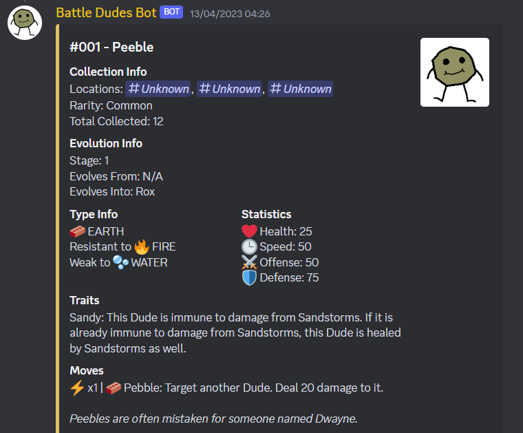

# DudesBot
Battle Dudes is a game about collecting Dudes and then battling with them. You collect dudes by just chatting in your favourite discord server. As of currently, you cannot battle with the dudes, but that doesn't stop you from growing a collection.

# How It Works
Every time you send a message in a channel, there is a small chance that you obtain a dude. Dudes come in a variety of rarities, the higher the rarity the harder it is to obtain. Every channel in your discord server is populated with different dudes, so if you want to obtain a dude you'll have to write in one of its appearance channels. There is a short cooldown to discourage spamming in channels for obtaining a dude.

# Setting Up Dudes
Since this was not originally intended for public use, there are a few things that need to be changed in order to use the bot.

## Running The Project
The project was made using Java 17, which is required to run the project. It uses Gradle as a build tool. Before running the project you need to create a configuration file located at "src/main/resources/botconfig.json". This file should contain the token of your discord bot application in the following json format:
```
{
  "token": <TOKEN>,
  "adminUsers": [
    <DISCORD USER ID>,
    <DISCORD USER ID>,
    ...
  ]
}
```
You can find out how to create a discord application and make a token here: https://discord.com/developers/docs/getting-started. Another thing you should change are the "admin" users of the bot. The format is an array of the discord user ids of the users.

Admin users have access to populating the database (explained later).

To run the project use
```
gradle bootRun
```
from the console in the project directory. This will start the bot and it can be used further from discord.

## Populating The Dudes Database
The charm of Battle Dudes is that you can add your own dudes! You can give your community its own flavour by having the users create their own dudes and drawing artwork. After the bot is running, there are special admin slash commands that allow adding new dudes into the database. The adming commands in discord are prefixed with "z_dev" so that they're put at the bottom of the commands list (alphabetical).

Every dude has multiple properties that need to be assigned once created. Below they're explained:
- The name of the dude;
- The artwork of the dude - How the dude will appear on screen;
- The rarity of the dude - It ranges from Common to Mythic, with higher rarities being dropped less often;
- The locations of the dude - The discord channels where the dude can be found;
- The evolutions of the dude - A dude can evolve into other dudes that are rarer, cooler variants of the dude. To obtain a dude, you must first have collected its evolution;
- The stage of the dude - Related to evolutions. Most dudes are stage 1 and their evolutions are the next stage. 
- Battle stats - Health, Speed, Offense, Defence - Used for combat, but are not used yet;
- Elemental types - The dudes can be different types, such as Fire, Earth etc, similar to Pokemon's typing system. Some dudes are weak or resistent towards certain types;
- The artist that drew the artwork - Credit your friends!

# Bot Commands

The discord bot comes with a lot of commands to see your collection of dudes. They can all be found in the discord bot's slash commands.

Each command has information on it that can be read both from the discord UI, or can be found in the resource files.

Examples of the important commands:

- /collection dudes - Creates an interactive discord embed that shows the dudes you own;
- /dude (name | id) - Displays information about a dude in a styled embed below is an example of the interface:

- /dudedex - Creates an interactive discord embed that lists all dudes in the bot.
- /toggle - Toggles a player into the game. By default players are not toggled in, which means they cannot obtain dudes normally. This is the avoid potential spam;